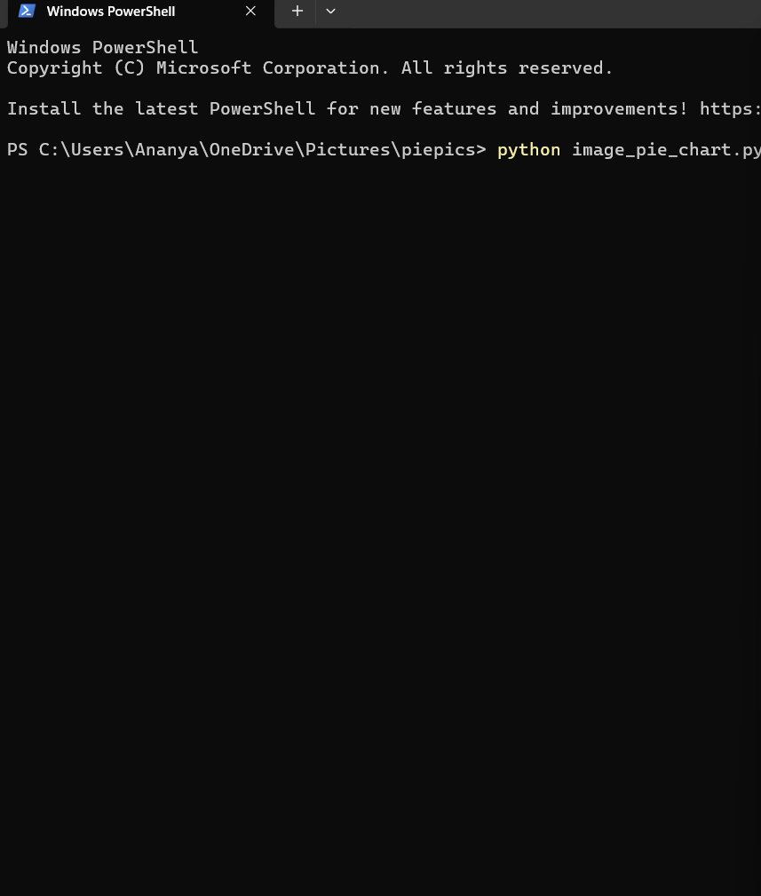
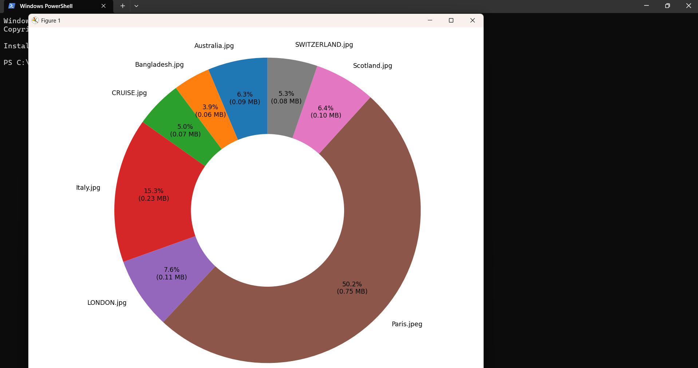

# Image Size Pie Chart Visualizer (Python + Matplotlib)

This project allows you to visualize image sizes using a **donut-style pie chart**.  
It uses **Python** and **Matplotlib** to display image names and their size distribution graphically.

---

## 📂 Working Structure

Keep all your images inside one folder and update the folder path inside the Python file.

---

## ✅ Usage

To generate a donut pie chart based on image file sizes:

---

---

